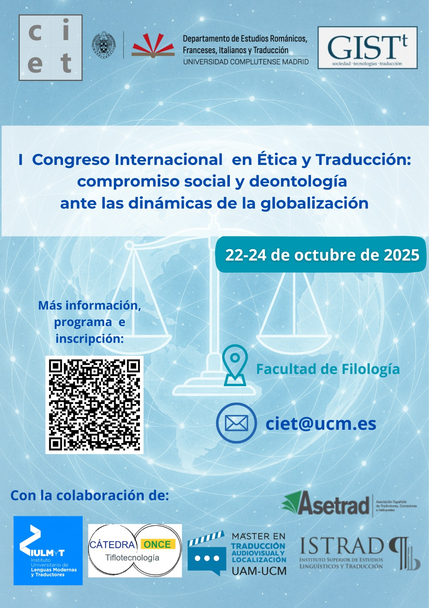

# Conferencias

El **I Congreso Internacional en Ética y Traducción**, que se celebrará en la Universidad Complutense de Madrid entre el 22 y 24 de octubre de 2025, se plantea como un espacio clave para analizar los desafíos éticos y deontológicos que enfrenta la práctica de la traducción e interpretación en un mundo cada vez más globalizado e interconectado.

Lugar de celebración: Facultad de Filología, Edificio A. Universidad Complutense de Madrid.

Plaza Menéndez Pelayo s/n. 28040 Madrid.

