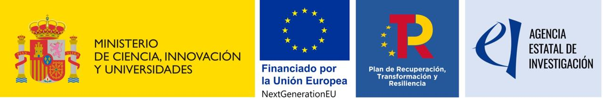

# Proyecto IrisEmpower

- **Título**: IrisEmpower: Sistema inteligente de rehabilitación basado en gafas de Realidad
Aumentada para mejorar la calidad de vida de pacientes con discapacidad visual (IRISEMP)
- **Investigadores Principales:** María Guijarro and Joaquín Recas.
- **Fecha de comienzo y finalización:** 01/09/2022 – 31/08/2025
- **Referencia:** PLEC2022-00926

## Resumen

Our Project, IrisEmpower is truly innovative because it represents the first Visual Rehabilitation System on Augmented Reality Glasses applicable to multiple degenerative pathologies, many of them with no medical solution for the moment. IrisEmpower takes advantage of AI analytical tools and will be capable of analyzing the video and audio signals collected by the augmented reality glasses, recognising objects, gestures and verbal commands, giving an optimized response. In addition, patients will be able to wear SmartGlasses as a Visual Aid with personalized settings for each visual condition.
Consequently, our Team (UCM & PLUSINDES), during this 3 years is going to carry out this Project, called “IrisEmpower”, performing several Work Packages (WPs) to be implemented step by step, with the purpose of commercializing the solutions developed for Ophthalmologic/Optical Clinics and their Patients and international traction.

## Artículos publicados

* Juan Bayón, Joaquín Recas, María Guijarro. *"An optimized, color-adaptive blue light filtering approach using a novel color space transformation"*. Displays 2025, Vol. 90. DOI: [j.displa.2025.103124](https://doi.org/10.1016/j.displa.2025.103124).
* Jiménez, J.J.; Bayón, J.; Guijarro, M.; Bernárdez-Vilaboa, R.; Cámara, R.; Recas, J. "*Retiplus: Augmented Reality Rehabilitation System to Enhance Autonomy and Quality of Life in Individuals with Low Vision*". *Electronics* 2025, *14*, 3589. [10.3390/electronics14183589](https://doi.org/10.3390/electronics14183589)

* Peng, H.; Bayon, J.; Recas, J.; Guijarro, M. "*Efficient Expiration Date Recognition in Food Packages for Mobile Applications*". Algorithms 2025, *18*, 286. [10.3390/a18050286](https://doi.org/10.3390/a18050286)

* Guijarro, M.; Bayon, J.; Martín-Carabias, D.; Recas, J. A "*Multi-Stage Method for Logo Detection in Scanned Official Documents Based on Image Processing"*. Algorithms 2024, 17, 170. DOI: [10.3390/a17040170](https://doi.org/10.3390/a17040170)

* González-Montero, G., Guijarro Mata-García, M., Moreno Martínez, C. *et al.* "*Rehab-AMD: co-design of an application for visual rehabilitation and monitoring of Age-related Macular Degeneration*". BMC Medical Informatics and Decision Making, 24, 233 (2024). DOI: [10.1186/s12911-024-02625-w](https://doi.org/10.1186/s12911-024-02625-w)

* Moreno Martínez, C., Piorno, J.R., Escribano Otero, J.J. *et al.* "*Responsive inclusive design (RiD): a new model for inclusive software development*". Universal Access in the Information Society  Article, 22, 893–902 (2023). DOI: [10.1007/s10209-022-00893-9](https://doi.org/10.1007/s10209-022-00893-9)

## Congresos

* Peng, H., Bayón, J., Recas, J., Guijarro, M. (2025). "*Lightweight Neural Networks for Expiration Date Accessibility*". In: Huang, DS., Li, B., Chen, H., Zhang, C. (eds) Advanced Intelligent Computing Technology and Applications. ICIC 2025. Communications in Computer and Information Science, vol 2564. Springer, Singapore. [10.1007/978-981-96-9911-7_27](https://doi.org/10.1007/978-981-96-9911-7_27)
* Juan Bayón Fernández, Joaquín Recas Piorno, Jonathan José Jiménez Jiménez, María Guijarro Mata-García. "*Filtrado de luz azul con mínima distorsión para vídeo*". XLV Jornadas de Automática, organizado por el Comité Español de Automática (CEA). Lugar de celebración Málaga, días 4, 5 y 6 de septiembre de 2024. DOI: [10.17979/ja-cea.2024.45.10771](https://doi.org/10.17979/ja-cea.2024.45.10771)
* Juan Bayón Fernández, Joaquín Recas Piorno, Jonathan José Jiménez Jiménez, María Guijarro Mata-García. *"Blue Light Digital Filter with accurate color representation, contrast and quality"*. Computer Graphics International (CGI) congress 2024 Geneva (to be published in LNCS, Srpinger). Regular Paper. Track number: 112. Link: [Conference Program](https://www.cgs-network.org/cgi24/program/)
* González Montero, G.;Guijarro Mata-García, M.; Recas Piorno, J.; Gutiérrez Hernández, A.; Sánchez Pérez, I. *"InnoVisión: projecto interdisciplinar para melhorar a qualidade de vida de pessoas com baixa visão”*.  XXV Congresso Internacional De Optometria E Contactologia (XXV CIOC’23), organizado por la União Profissional Dos Ópticos E Optometristas Portugueses. Fecha: 24, 25 e 26 de marzo de 2023. Ponencia Invitada.

## Tesis Defendidas

* Doctorando: Juan Bayón Fernández. "Técnicas de procesamiento de imagen en realidad aumentada para la mejora de la calidad de vidade las personas con baja visión". Directores: María Guijarro Mata-García y Joaquín Recas Piorno. Fecha de defensa 17 de febrero de 2026.

## Tesis en Curso

* Doctorando: Jonathan José Jiménez Jiménez. "*Métodos de interacción humano-computador (HCI) y ayudas visuales aplicados a dispositivos de realidad aumentada para personas con baja visión*". Directores: Joaquín Recas Piorno y María Guijarro Mata-García. Fecha prevista de depósito 2026.
* Doctorando: Hao Peng. "*Reconocimiento de gestos y segmentación de imágenes para el análisis de video en tiempo real en unas gafas de realidad aumentada para ayuda a personas con baja visión*".  Directores: Joaquín Recas Piorno y María Guijarro Mata-García. Fecha prevista de depósito 2026.

## Patentes aceptadas

* Bernárdez Vilaboa, R.; Guijarro Mata-García, M.; Recas Piorno, J.; Sánchez Pérez, I.; Gutierrez Hernández, A.L.; Martín Pérez, Y.; González Montero, G. *"Dispositivo de medida visual para tiradores de carabina con o sin deficiencia visual"*. Nº de publicación: ES2940982 (B2). Fecha de publicación: 25-9-2023. [Enlace](https://es.espacenet.com/publicationDetails/originalDocument?FT=D&date=20230925&DB=&locale=es_ES&CC=ES&NR=2940982B2&KC=B2&ND=4).

## Patentes en revisión

* Recas Piorno, J.; Guijarro Mata-García, M.; Bernárdez Vilaboa, R. *"Dispositivo accesible a personas ciegas para el estudio del funcionamiento de circuitos digitales secuenciales"*. Nº de publicación: ES2958784 A1. [Enlace](https://consultas2.oepm.es/InvenesWeb/detalle?referencia=P202330519).

## Otras publicaciones

* Ricardo Bernárdez Vilaboa, Juan Cedrún Sánchez, Gema Martínez Florentín, Javier Povedano Montero, Rut González Jiménez, María Sanz Antolín y David Blanco Darriba. Seminario *“Nuevas tecnologías en la salud visual: intervención multidisciplinar”* celebrado en la facultad de Óptica y Optometría con la participación de charla sobre el uso de retiplus-2 entre todas las conferencias realizadas.
* Ricardo Bernárdez Vilaboa y Juan Cedrún Sánchez. *Estudio clínico del uso de retiplus-2 en población con maculopatías oculares variadas*. Madrid.
